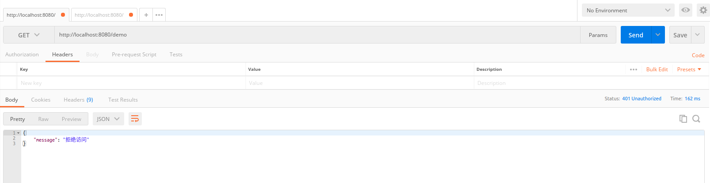

# spring-security-demo

## 简介
本例基于SpringSecurity做为权限认证框架，用于控制接口的访问权限。并给出登录的流程、换取token的示例；用token访问需要权限接口的示例。

下面将简述使用方法、原理。

## 使用方法
1. 在application.yml中配置数据库的地址账号密码，执行resources/sql/mydb.sql，写入数据。
数据中只一组账号密码yang/123456
2. 通过`/user/login`端点登录，http://localhost:8080/user/login?username=yang&password=123456 POST方法,换回access_token。
3. 在Header中加入key为`Authorization`，value为上一步获取的access_token，访问需要权限的端点`/demo`，即可返回结果


登录

访问有权限端点

如果不带Token访问，则被拒绝

## 核心原理
在前后端分离的架构中，权限认证主要包含两个主要的过程：
1. 通过用户名密码换取一个令牌（Token），令牌具有不可修改性，以保证权限的安全。
2. 用户在之后一段时间访问则不用再输入用户名密码，通过Token则可以访问被权限管理限制的接口。

再进一步说，
1. 流程1，是通过用户名密码，从数据库中拿到用户的信息、权限等，并转换成安全框架（这里就是Spring Security）中可识别的身份信息（即Authentication）
，即视为登录成功，之后将必要的些信息转化为Token。
2. 流程2，则是将Token解析出来，转成安全框架中可识别身份信息，通过可识别的身份信息，框架再去判断该权限是否可以访问该端点。

可以看到在流程1&2中，前半部分是相同的，都是将凭证（前者为用户名密码，后者为token）转为框架可识别的身份信息，这一步我们视为`认证`流程。
后半部分则为，各自认证成功的操作逻辑。流程1生成token较为简单，流程2的后半部分则是安全框架（Spring Security）中权限管理的决策逻辑，即决定是否可以访问的逻辑，这一步我们视为`授权`流程。

下面将从`认证`和`授权`两部分来讲。

## 认证

### SecurityFilterChain 过滤器链
Spring Security采用的是filterChain的设计方式，主要的功能大都由过滤器实现，在启动项目的时候，可以在日志中看到已有的过滤器，可在类似下面的日志里找到`DefaultSecurityFilterChain`，这里面则是SecurityFilterChain
```
2019-03-14 16:43:02.369  INFO 27251 --- [  restartedMain] o.s.s.web.DefaultSecurityFilterChain     : Creating filter chain: org.springframework.security.web.util.matcher.AnyRequestMatcher@1, [org.springframework.security.web.context.request.async.WebAsyncManagerIntegrationFilter@1d88a93d, org.springframework.security.web.context.SecurityContextPersistenceFilter@184d52d7, org.springframework.security.web.header.HeaderWriterFilter@29d86b1e, org.springframework.security.web.authentication.logout.LogoutFilter@2ce28138, org.springframework.security.web.authentication.UsernamePasswordAuthenticationFilter@320a4f73, com.yang.security.config.JwtAuthorizationTokenFilter@37e7a410, org.springframework.security.web.savedrequest.RequestCacheAwareFilter@534e475b, org.springframework.security.web.servletapi.SecurityContextHolderAwareRequestFilter@39137df7, org.springframework.security.web.authentication.AnonymousAuthenticationFilter@7c42403f, org.springframework.security.web.session.SessionManagementFilter@1fa2ad2b, org.springframework.security.web.access.ExceptionTranslationFilter@65869e97, org.springframework.security.web.access.intercept.FilterSecurityInterceptor@163d3c44]
```

```
1. WebAsyncManagerIntegrationFilter
2. SecurityContextPersistenceFilter
3. HeaderWriterFilter
4. LogoutFilter
5. **UsernamePasswordAuthenticationFilter**
6. **JwtAuthorizationTokenFilter**
7. RequestCacheAwareFilter
8. SecurityContextHolderAwareRequestFilter
9. SessionManagementFilter
10. ExceptionTranslationFilter
11. FilterSecurityInterceptor
```

这里主要讲一下`UsernamePasswordAuthenticationFilter`及相关的代码，顺带的说一下，我们自己实现`JwtAuthenticationFilter`及周边。

### UsernamePasswordAuthenticationFilter

`UsernamePasswordAuthenticationFilter`，顾名思义，是用来处理用户名密码登录的过滤器。所有的Filter核心方法都是`doFilter`，
该过滤器的doFilter在其父抽象类中，过滤器只需实现`attemptAuthentication`方法即可。

源码摘录如下（并不是完整的源码，拣选重要部分阐述逻辑）：
```java
public class UsernamePasswordAuthenticationFilter extends AbstractAuthenticationProcessingFilter {
  
  public Authentication attemptAuthentication(HttpServletRequest request,
			HttpServletResponse response) throws AuthenticationException {

	String username = obtainUsername(request);
	String password = obtainPassword(request);
	
	// 根据用户名密码构造AuthenticationToken
	UsernamePasswordAuthenticationToken authRequest = new UsernamePasswordAuthenticationToken(
				username, password); 
	
    // 将AuthenticationToken放入AuthenticationProvider进行认证
	return this.getAuthenticationManager().authenticate(authRequest); 
  }
}
```
AuthenticationManager中维护这一个List<AuthenticationProvider>；
首先通过`AuthenticationProvider`的`supports`方法检测是否支持该类型的AuthenticationToken；如果支持，则使用`authenticate`将`AuthenticationToken`转换成认证的`Authentication`。
```java
public class ProviderManager implements AuthenticationManager, MessageSourceAware,
		InitializingBean {

	private List<AuthenticationProvider> providers = Collections.emptyList();
	private AuthenticationManager parent;
	private boolean eraseCredentialsAfterAuthentication = true;

    // 遍历Providers
	public Authentication authenticate(Authentication authentication)
			throws AuthenticationException {
		
        
		for (AuthenticationProvider provider : getProviders()) {
		    // 如果Authentication不符合，跳过后边步骤，继续循环
			if (!provider.supports(toTest)) {
				continue;
			}

            // 如果Authentication符合，则使用该Provider进行authenticate操作
			result = provider.authenticate(authentication);
            
			if (result != null) {
                copyDetails(authentication, result);
            	break;
			}
		}

		if (result != null) {
			if (eraseCredentialsAfterAuthentication
					&& (result instanceof CredentialsContainer)) {
				((CredentialsContainer) result).eraseCredentials();
			}
			return result;
		}
	}
	
}
```
下面是`DaoAuthenticationProvider`的父抽象类，父类中核心方法就是`authenticate`方法，而子类则只用实现`retrieveUser`方法，
该方法调用UserDetailsService的loadUserByUsername。对于我们用户而言，所要做的就是实现`UserDetailsService`，重写其中的方法，
通过`loadUserByUsername`从数据库中拿到用户名和密码，至于后面的验证，事实上都是由`AbstractUserDetailsAuthenticationProvider`已经做好了。

```java

public abstract class AbstractUserDetailsAuthenticationProvider implements
		AuthenticationProvider, InitializingBean, MessageSourceAware {

	public Authentication authenticate(Authentication authentication)
			throws AuthenticationException {
	  
		String username = (authentication.getPrincipal() == null) ? "NONE_PROVIDED"
				: authentication.getName();
        
		// DaoAuthenticationProvider中重载retrieveUser方法，而该方法中的核心方法就是UserDetailsService的loadUserByUsername
		user = retrieveUser(username,
				(UsernamePasswordAuthenticationToken) authentication);
		
		// preCheck
		preAuthenticationChecks.check(user);
        			additionalAuthenticationChecks(user,
        					(UsernamePasswordAuthenticationToken) authentication);
        // postCheck
		postAuthenticationChecks.check(user);
        
		// 检查成功没有问题，则创建Authentication示例
		return createSuccessAuthentication(principalToReturn, authentication, user);
	}
	
	public boolean supports(Class<?> authentication) {
		return (UsernamePasswordAuthenticationToken.class
				.isAssignableFrom(authentication));
	}
}
```

总结一下：
1. `UsernamePasswordAuthenticationFilter.doFilter`获取用户名密码,生成`UsernamePasswordAuthenticationToken`；
2. 将`UsernamePasswordAuthenticationToken`交给`DaoAuthenticationProvider`验证；
3. `DaoAuthenticationProvider`通过`UserDetailsService.loadUserByUsername`中获取用户名、密码、权限以及其他信息，并进行比对；比对成功，则生成`Authentication`；
4. `UsernamePasswordAuthenticationFilter`将`Authentication`放入`SecurityContextHolder`，认证成功；

齐活！
### to be continue...


## 授权


## 链接
[spring-security-demo](https://github.com/JevonYang/spring-security-demo "spring-security-demo")